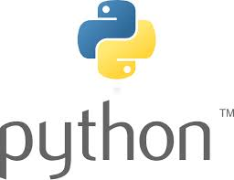
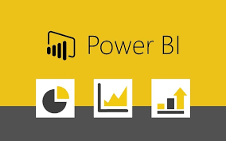
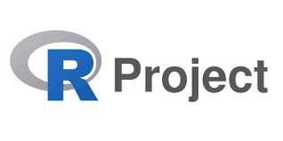
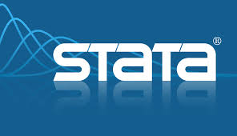

# ¡¡Hola!!, Soy Julian David Baquero

Me considero un explorador de datos, es agradable descubrir y rescatar información valiosa derivada del análisis de datos, experimentar utilizando estadística y econometría para revelar patrones y soluciones innovadoras. 📊🔍🚀  
‘Sin datos, solo eres una persona dando su opinión’.

- **Economista | Data Analyst | Maestría en econometría | Maestría en finanzas.**
- **Python | SQL | Power Bi**
- **Autodidacta en economía comportamental, datos y nuevas tecnologías.**
- **Econometria | Series de tiempo | Estadistica multivariante | netodos cuantitativos**
- **Mis proyectos están disponibles en [GitHub](https://github.com/jdbaquero84?tab=repositories).**
- **Me encanta encontrar soluciones, amante de la naturaleza, los animales y la bicicleta.**

## Tecnologías Utilizadas

## Stack Tecnológico

|  |  |  |
| :---------------------------: | :-----------------------------: | :------------------------: |
| [Python](https://docs.python.org/3/) | [Power BI](https://learn.microsoft.com/en-us/power-bi/) | [SQL](https://www.w3schools.com/sql/sql_quickref.asp) |

|  |  |  |
| :----------------------: | :--------------------------: | :--------------------------: |
| [R](https://www.r-project.org/other-docs.html) | [Stata](https://www.stata.com/features/documentation/) | [Eviews](https://www.eviews.com/Learning/index.html) |

## Contacto

|  |  |
| :--------------------------: | :-----------------------------: |
| [Email](mailto:juliandbrazil@gmail.com) | [LinkedIn](https://www.linkedin.com/in/julian-david-baquero-pe%C3%B1a-72942a246/) |
